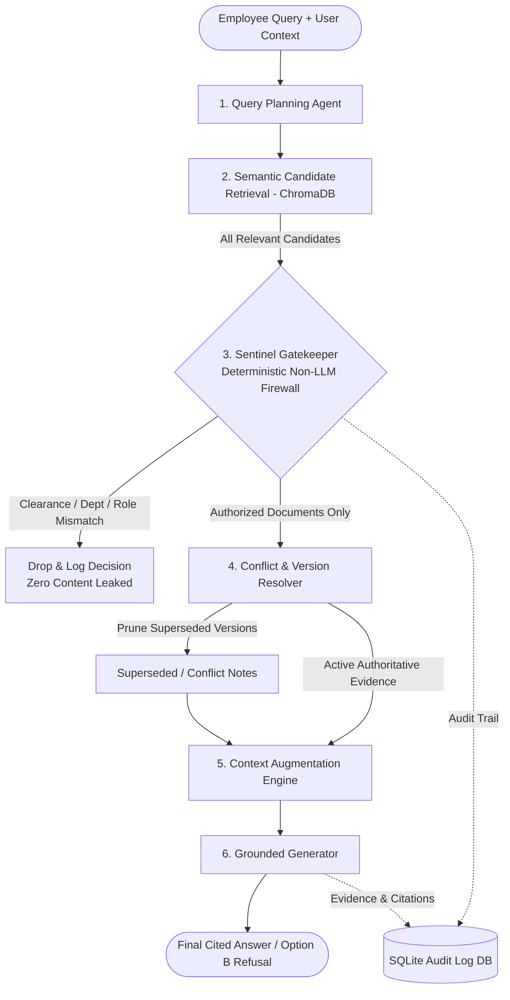

# SentinelRAG 🛡️

[](https://www.python.org/)
[](https://www.trychroma.com/)
[](https://streamlit.io/)
[](https://github.com/)
[](https://pytest.org/)

> **Secure Enterprise Research Agent with Deterministic Pre-LLM Authorization & Conflict Resolution**

SentinelRAG addresses a critical vulnerability in enterprise Retrieval-Augmented Generation (RAG): **unauthorized document exposure**. 

In conventional RAG pipelines, retrieval operates purely on semantic similarity. When an employee queries a confidential topic, the retriever indexes top-ranked classified chunks and directly injects them into the language model's prompt context. **SentinelRAG eliminates this vulnerability** by deploying a deterministic, non-LLM **Authorization Gatekeeper** and **Conflict Resolver** directly between Retrieval and Context Augmentation.

---

## 👥 Team: Pragyaan Pythons

- **Mohammed Emad Uddin** (Team Lead)
- **Gurram Pardha Venkata Sai Kumar**
- **Punna Srichatur**
- **Mohd Farhan Ahmed**

---

## 📌 Problem Statement: "The Employee Who Asked for Too Much"

Companies maintain thousands of internal documents across different clearance tiers (`Public`, `Internal`, `Confidential`, `Restricted`). Different employees possess different roles, departments, and clearance levels.

When an employee asks:
> *"What is the Q4 revenue forecast?"*

The system must:
1. **Search candidate documents** across the knowledge base.
2. **Enforce authorization deterministically** before document content ever reaches the prompt or LLM.
3. **Resolve outdated and conflicting versions** among authorized documents based on effective dates.
4. **Return cited answers** strictly referencing evidence the user is cleared to view.
5. **Safely refuse** without leaking secret values when the answer exists only in documents the user cannot access.
6. **Log a complete audit trail** for enterprise compliance and traceability.

---

## 🏛️ System Architecture



### Key Differences from Vanilla RAG:
| Workflow Stage | Vanilla RAG | SentinelRAG (Our Build) |
| :--- | :--- | :--- |
| **Retrieval** | Semantic similarity search only | Semantic ChromaDB search + hybrid entity matching |
| **Pre-LLM Gate** | ❌ **None** (Blindly passes chunks to LLM) | ✅ **Deterministic Gatekeeper** (Clearance + Dept + Role) |
| **Conflict Handling** | ❌ May hallucinate between old/new versions | ✅ **Automated Resolver** (Compares versions & dates) |
| **Prompt Context** | Chunks of all classifications exposed | **Only authorized, authoritative evidence injected** |
| **Unauthorized Queries** | Leaks secret content or fails silently | **Option B Access-Aware Safe Refusal** (Zero Leak) |
| **Auditability** | Little to none | **Full SQLite audit trail** per query |

---

## 📁 Repository Structure

```
SentinelRAG/
├── data/
│   ├── test_input_a/              # Benchmark A: Authorized Answer
│   │   ├── user.json
│   │   └── documents.json
│   ├── test_input_b/              # Benchmark B: Relevant but Unauthorized
│   │   ├── user.json
│   │   └── documents.json
│   ├── test_input_c/              # Benchmark C: Conflict & Version Resolution
│   │   ├── user.json
│   │   └── documents.json
│   ├── sample_docs.json           # Comprehensive enterprise knowledge base
│   ├── chroma_db/                 # Persistent ChromaDB vector database (generated)
│   └── audit.db                   # SQLite compliance audit database (generated)
├── src/
│   ├── __init__.py
│   ├── models.py                  # Pydantic models (User, Document, Clearance, Audit)
│   ├── storage/
│   │   ├── __init__.py
│   │   ├── document_store.py      # JSON document ingestion and memory cache
│   │   └── audit_logger.py        # SQLite persistent audit service
│   ├── rag/
│   │   ├── __init__.py
│   │   ├── vector_store.py        # Persistent ChromaDB vector store
│   │   ├── retriever.py           # Hybrid semantic retriever
│   │   ├── context_builder.py     # Prompt augmentation engine
│   │   └── generator.py           # Grounded answer & Option B safe refusal engine
│   ├── agents/
│   │   ├── __init__.py
│   │   ├── query_planner.py       # Query planning & entity extraction
│   │   ├── authorization_gate.py  # Zero-leak deterministic ACL gatekeeper
│   │   └── conflict_resolver.py   # Version & effective date conflict resolver
│   ├── pipeline.py                # Master orchestration pipeline
│   └── cli.py                     # Rich terminal CLI
├── tests/
│   ├── __init__.py
│   ├── test_gatekeeper.py         # ACL clearance, dept, and role unit tests
│   ├── test_conflict_resolver.py  # Version and date tie-breaker unit tests
│   ├── test_vector_store.py       # ChromaDB vector indexing unit tests
│   ├── test_audit_logger.py       # SQLite persistence unit tests
│   └── test_scenarios.py          # End-to-end benchmark tests (Inputs A, B, C)
├── app.py                         # Interactive Streamlit Web Dashboard
├── requirements.txt               # Project dependencies
├── pragyaanpythons.md             # Original project design document
└── README.md                      # This file
```

---

## ⚙️ Setup & Installation

### Prerequisites
- Python 3.12+ installed
- Git installed

### 1. Clone the Repository
```bash
git clone https://github.com/Srichatur24/SentinelRAG.git
cd SentinelRAG
```

### 2. Create and Activate a Python Virtual Environment

#### On Windows (PowerShell):
```powershell
python -m venv .venv
.\.venv\Scripts\activate
```

#### On Windows (Command Prompt):
```cmd
python -m venv .venv
.\.venv\Scripts\activate.bat
```

#### On Linux / macOS:
```bash
python3 -m venv .venv
source .venv/bin/activate
```

### 3. Install Dependencies
```bash
pip install -r requirements.txt
```

### 4. Initialize Local Knowledge Base (First-Time Setup)
Because generated databases (`data/chroma_db/` and `data/audit.db`) are excluded from Git tracking via `.gitignore`, run the ingestion command once after cloning to populate your local ChromaDB vector database:
```bash
python -m src.cli ingest --docs data/sample_docs.json
```
> *Note: If you launch the Streamlit dashboard (`streamlit run app.py`) directly, it will also automatically detect an empty vector store and seed it on first launch.*

---

## 💻 CLI Usage Guide

The Command-Line Interface (`src/cli.py`) is powered by `rich` for formatting, clear tabular output, and real-time security decision transparency.

### 1. Run Automated Benchmarks (Test Inputs A, B, C)
Executes all three official test scenarios and prints an executive verification matrix:
```bash
python -m src.cli run-tests
```
**Sample Output:**
```
┌─────────────────────────────────────────────────────────────────────────────┐
│ Running SentinelRAG Test Scenarios (Inputs A, B, C)                         │
└─────────────────────────────────────────────────────────────────────────────┘
                           Test Verification Matrix                            
┌────────────────┬───────────────┬───────────┬────────────────┬───────────────┐
│ Scenario       │ Query         │  Result   │ Evidence &     │ Zero-Leak     │
│                │               │           │ Citations      │ Status        │
├────────────────┼───────────────┼───────────┼────────────────┼───────────────┤
│ Test Input A:  │ What is the   │ PASS [OK] │ DOC-101 (v2.0) │ VERIFIED (0   │
│ Authorized     │ Q4 revenue    │           │                │ Leaks)        │
│ Answer         │ forecast?     │           │                │               │
│ Test Input B:  │ What is the   │ PASS [OK] │ (None -        │ VERIFIED (0   │
│ Relevant but   │ Q4 revenue    │           │ Refusal)       │ Leaks)        │
│ Unauthorized   │ forecast?     │           │                │               │
│ (Zero-Leak)    │               │           │                │               │
│ Test Input C:  │ What is the   │ PASS [OK] │ DOC-302 (v2.0) │ VERIFIED (0   │
│ Authorized     │ latest Q4     │           │                │ Leaks)        │
│ Conflict &     │ revenue       │           │                │               │
│ Version        │ forecast?     │           │                │               │
│ Resolution     │               │           │                │               │
└────────────────┴───────────────┴───────────┴────────────────┴───────────────┘
All 3 official benchmark test inputs PASSED with complete zero-leak verification!
```

---

### 2. Ingest Documents into ChromaDB
Indexes sample enterprise documents into the local persistent vector database:
```bash
python -m src.cli ingest --docs data/sample_docs.json
```

---

### 3. Run Individual Queries via CLI

#### Scenario A: Authorized Employee Query
```bash
python -m src.cli query --user data/test_input_a/user.json --query "What is the Q4 revenue forecast?"
```
- **User**: U102 (Role: Finance, Dept: Finance, Clearance: Internal)
- **Result**: Permitted; answers with `120 crore` citing `DOC-101 (v2.0)`. `DOC-102` (Engineering) is dropped.

#### Scenario B: Relevant but Unauthorized Query (Zero Leak)
```bash
python -m src.cli query --user data/test_input_b/user.json --query "What is the Q4 revenue forecast?"
```
- **User**: U205 (Role: Marketing, Dept: Marketing, Clearance: Internal)
- **Target Doc**: DOC-201 (Clearance: Restricted, Allowed Dept: Executive)
- **Result**: Access-aware safe refusal:
  > *"Documents answering this query exist in the knowledge base, but your current clearance level (Internal) or department (Marketing) does not permit access."*
- **Zero-Leak Invariant**: The confidential revenue (`145 crore`) and document title are never exposed.

#### Scenario C: Conflict & Multi-Version Resolution
```bash
python -m src.cli query --user data/test_input_c/user.json --query "What is the latest Q4 revenue forecast?"
```
- **User**: U301 (Finance, Internal)
- **Docs Evaluated**: DOC-301 (v1.0, 2026-06-01, 110 crore) vs DOC-302 (v2.0, 2026-09-01, 125 crore)
- **Result**: Cites `DOC-302 (v2.0)` with `125 crore`, and appends:
  > *"Note: DOC-301 (v1.0, 2026-06-01) is superseded by DOC-302 (v2.0, 2026-09-01)."*

---

### 4. Inspect Compliance Audit Trail
Displays the SQLite audit records for compliance verification:
```bash
python -m src.cli audit --limit 10
```

To filter by a specific query ID:
```bash
python -m src.cli audit --query-id QRY-XXXXXXXX
```

---

## 🌐 Web GUI Usage Guide (Streamlit Dashboard)

SentinelRAG includes an interactive web interface for hackathon demonstrations and live testing.

### Launch the Dashboard
```bash
streamlit run app.py
```
*The app will automatically open in your default browser at `http://localhost:8501`.*

### Dashboard Features

1. **Sidebar Employee Persona Switcher**:
   - Quick-switch between preconfigured enterprise personas:
     - 💼 **Finance Analyst** (`U102`, Finance, Internal)
     - 📢 **Marketing Manager** (`U205`, Marketing, Internal)
     - 📊 **Finance Director** (`U301`, Finance, Internal)
     - ⚖️ **Executive Counsel** (`U401`, Executive, Restricted)
     - 🛠️ **Custom Persona** (custom ID, role, department, and clearance)
   - Real-time indicator of active clearance badge and ChromaDB document count.

2. **Tab 1: Live RAG Query Engine**:
   - Submit natural language queries or click one of the quick sample prompt buttons.
   - **Step-by-step visual execution**:
     - Candidate retrieval count.
     - Gatekeeper decision metrics (**Authorized** vs **Blocked**).
     - Full security breakdown showing why unauthorized files were blocked (Clearance, Dept, or Role mismatch).
     - Final grounded response with citations or Option B safe refusal.

3. **Tab 2: Official Benchmarks (1-Click Verification)**:
   - Run Test Input A, Test Input B, and Test Input C with a single click.
   - View expandable cards displaying input data, system response, authorized evidence, and zero-leak verification badges.

4. **Tab 3: Compliance Audit Trail**:
   - Filter and search the complete SQLite audit log table.
   - Audit fields include: Timestamp, Query ID, Employee Context, Candidate Docs, Authorized Docs, Blocked Docs, Refusal Status, and Citations.

5. **Tab 4: Knowledge Base Explorer**:
   - Visual document cards showcasing all ingested documents, versions, effective dates, allowed departments, and color-coded clearance tags (`Public`, `Internal`, `Confidential`, `Restricted`).

---

## 🧪 Automated Testing

SentinelRAG includes an automated test suite with **100% pass rate across 11 test suites**:

```bash
pytest tests/ -v
```

### Test Coverage Summary:
- `tests/test_gatekeeper.py`:
  - `test_clearance_hierarchy`: Verifies Public < Internal < Confidential < Restricted access ordering.
  - `test_department_mismatch`: Verifies blocking when user department is not in `allowed_departments`.
  - `test_role_mismatch`: Verifies blocking when user role is not in `allowed_roles`.
  - `test_wildcard_permissions`: Verifies open access when allowed lists are empty or contain wildcard `*`.
- `tests/test_conflict_resolver.py`:
  - `test_effective_date_and_version_superseding`: Verifies later effective dates and higher versions take precedence.
  - `test_identical_date_and_version_tie_break`: Verifies tie-breaking highlights discrepancies between active docs.
- `tests/test_vector_store.py`:
  - `test_chroma_add_and_search`: Verifies ChromaDB persistent vector ingestion and nearest-neighbor retrieval.
- `tests/test_audit_logger.py`:
  - `test_log_and_retrieve_audit`: Verifies SQLite transaction logging and retrieval.
- `tests/test_scenarios.py`:
  - `test_scenario_a_authorized_answer`: End-to-end verification of Test Input A.
  - `test_scenario_b_unauthorized_zero_leak`: End-to-end verification of Test Input B (Zero-Leak).
  - `test_scenario_c_conflict_and_version_resolution`: End-to-end verification of Test Input C.

---

## 🔒 Security Invariants & Guarantees

1. **Non-LLM Gatekeeper**:
   - Authorization is enforced purely in deterministic code. An LLM is never relied upon to decide if a document should be kept or dropped.
2. **Zero In-Context Leakage**:
   - If a document is classified above the user's clearance or belongs to another department/role, its content is dropped from memory before the prompt is assembled.
3. **Safe Refusal (Option B)**:
   - When restricted documents match a query, the assistant informs the employee that access is restricted without revealing secret values, document IDs, or confidential excerpts.
4. **Complete Compliance Traceability**:
   - Every single query logs an indelible record into `data/audit.db` containing the exact reasons why any document was approved or blocked.

---

## 📄 License

This project is developed for the SentinelRAG Enterprise Agent challenge by **Team Pragyaan Pythons**.